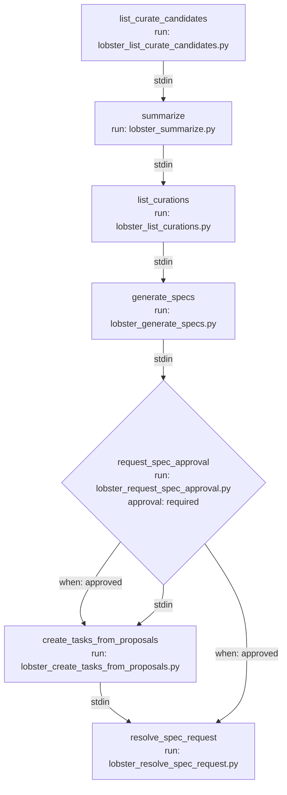

```mermaid
flowchart TD
  list_curate_candidates["list_curate_candidates\nrun: lobster_list_curate_candidates.py"]
  summarize["summarize\nrun: lobster_summarize.py"]
  list_curations["list_curations\nrun: lobster_list_curations.py"]
  generate_specs["generate_specs\nrun: lobster_generate_specs.py"]
  request_spec_approval{"request_spec_approval\nrun: lobster_request_spec_approval.py\napproval: required"}
  create_tasks_from_proposals["create_tasks_from_proposals\nrun: lobster_create_tasks_from_proposals.py"]
  resolve_spec_request["resolve_spec_request\nrun: lobster_resolve_spec_request.py"]

  list_curate_candidates -->|stdin| summarize
  summarize -->|stdin| list_curations
  list_curations -->|stdin| generate_specs
  generate_specs -->|stdin| request_spec_approval
  request_spec_approval -->|when: approved| create_tasks_from_proposals
  request_spec_approval -->|stdin| create_tasks_from_proposals
  create_tasks_from_proposals -->|stdin| resolve_spec_request
  request_spec_approval -->|when: approved| resolve_spec_request
```
