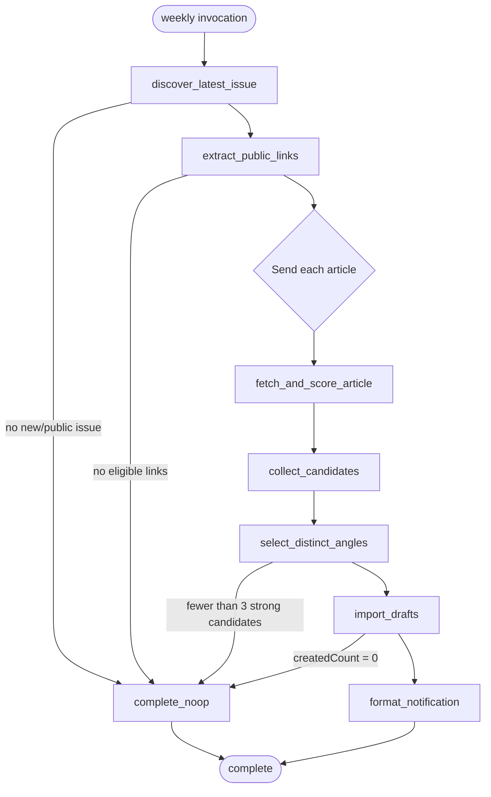

# CTO Craft recurring tweet-draft pipeline — LangGraph POC tech design

## Delivery metadata

- **Task:** `9dfe56e4-13c4-4bb4-b53f-de7c77afd0d2` — CTO Craft recurring tweet-draft pipeline
- **Repository:** `Stoffer-Industries/sindustries`
- **Branch:** `task-9dfe56e4-cto-craft-langgraph`
- **Worktree:** `/Users/quinnstoffer/.openclaw/workspace/worktrees/task-9dfe56e4-cto-craft-langgraph`
- **Product spec:** `brain/tasks/specs/in-progress/cto-craft-tweet-pipeline.md`
- **Design intent:** use this bounded content workflow as the first production-shaped LangGraph proof of concept before considering LangGraph for incident response or broader workflow consolidation.

## Product intent summary

Once per week, after Tech Manager Weekly's Monday publication window, the workflow:

1. discovers the latest public issue;
2. follows only its public, non-gated article links;
3. evaluates those articles against Tom's documented worldview;
4. selects three to five distinct, strong tweet angles;
5. creates Content Scheduler items in `draft` state with `source: cto_craft` and the originating article URL as `sourceRef`;
6. notifies Tom only when new drafts were created.

A repeated run against an already-processed issue, or a week with no new issue, creates nothing and produces no user-visible message.

The workflow does not approve, schedule, or publish content. Tom retains those decisions in Mission Control.

## Goals

- Validate LangGraph's graph control flow, parallel fan-out, checkpoint persistence, retry behavior, conditional no-op path, and resumability in a real but low-risk workflow.
- Keep Content Scheduler as the authoritative owner of draft data and deduplication.
- Make repeated and overlapping runs safe: no duplicate Content Scheduler items and no duplicate success notification.
- Treat newsletter and article content as untrusted input with bounded network and model behavior.
- Produce an operationally useful POC whose runtime evidence can inform the later incident-response decision.
- Preserve a clean extraction path when Content Scheduler moves from `tasks-api` into `services/content-scheduler-api`.

## Non-goals

- Automatic approval, scheduling, or publication.
- Authenticated, paywalled, member-only, or mailbox ingestion.
- Sources other than Tech Manager Weekly and the public articles linked from its latest issue.
- Threads, media, replies, or direct X posting.
- A general LangGraph hosting platform, LangGraph Agent Server, LangSmith Deployment, or LangSmith as a required runtime.
- Migrating another Sindustries workflow to LangGraph in this task.
- Solving the existing Content Scheduler service extraction or delayed-job durability work.
- Letting fetched content select tools, URLs, recipients, credentials, or actions.

## Architecture decision

### Use the LangGraph OSS library as an embedded Python workflow

Add an isolated Python package under:

```text
agents/workflows/cto-craft-tweet-drafts/
```

The package owns graph orchestration and workflow-specific adapters. It uses:

- `langgraph` for graph construction, branches, parallel `Send` fan-out, retries, and state transitions;
- `langgraph-checkpoint-postgres` for durable checkpoints;
- `psycopg` for the checkpoint connection and any workflow-level advisory lock;
- `httpx` for bounded HTTP fetching;
- `beautifulsoup4` for dependency-light issue/article extraction;
- `pydantic` for graph state and LLM output validation.

Dependencies live in a package-local `pyproject.toml` and committed `uv.lock`. Runtime and CI invoke it with `uv run --frozen`; they do not assume LangGraph is globally installed. This is the repository's first dependency-managed Python workflow, so dependency scope remains local rather than introducing a root Python environment.

### Why Python is justified here

The repository normally prefers Python for agent workflow glue and Rust for durable state-machine engines. Python is justified for this POC because:

- LangGraph's mature implementation and examples are Python-first;
- the workflow is mostly HTTP, HTML extraction, structured model calls, and API orchestration;
- it is not on a product request path and does not own product-domain state;
- the task explicitly exists to evaluate LangGraph rather than recreate graph semantics in Rust.

The package boundary prevents Python/LangGraph types from leaking into Content Scheduler or Mission Control. Content Scheduler receives ordinary JSON over its API.

### Do not adopt Agent Server for the POC

The graph runs as a short-lived CLI process invoked by OpenClaw cron. PostgreSQL checkpoints provide restart persistence. We deliberately avoid Agent Server, Redis, Kubernetes, LangSmith credentials, and deployment-license coupling until the POC demonstrates that LangGraph itself is useful.

This means the POC does not evaluate Agent Server queueing or horizontal-worker semantics. That limitation is recorded in the evaluation section rather than hidden.

## Ownership boundary check

### Natural sources of truth

| Concern | Natural owner / source of truth |
|---|---|
| Draft content items and deduplication | Content Scheduler database and API |
| Workflow execution checkpoints | LangGraph PostgreSQL checkpointer |
| Weekly schedule and Telegram delivery | OpenClaw cron/runtime boundary |
| Tom's worldview profile used for scoring | Versioned workflow prompt/profile in this repository |
| Approval, scheduling, and publishing | Existing Content Scheduler/Mission Control flow |
| Task/spec/design state | Tasks API and repository docs |

LangGraph checkpoints are execution state, not product data and not proof that an external write happened exactly once. The Content Scheduler API must enforce idempotency transactionally.

### Content Scheduler placement

Content Scheduler currently lives in `services/tasks-api` as known temporary coupling. This feature adds the smallest durable API contract at that existing domain surface, rather than writing directly to Prisma from Python.

The workflow client depends only on:

```text
POST /api/v1/content-scheduler/imports/cto-craft
```

When task `94d5e4fc` extracts `services/content-scheduler-api`, the route, database constraint, and tests move with the domain. The Python client changes only its base URL/configuration; no graph logic or data migration is required.

### No interim file ledger

Do not add a JSON file containing processed issues, article URLs, notification flags, or retry timestamps. That would recreate the orchestration state this POC is intended to evaluate and create a second deduplication authority. LangGraph owns execution progress; Content Scheduler owns created-item uniqueness.

## Workflow graph



### Graph state

The persisted state is typed and JSON-serializable:

```python
class PipelineState(TypedDict):
    run_key: str                    # Auckland ISO week, e.g. 2026-W33
    started_at: str
    issue_url: str | None
    issue_title: str | None
    issue_published_at: str | None
    article_links: list[ArticleLink]
    candidates: Annotated[list[AngleCandidate], operator.add]
    selected_angles: list[SelectedAngle]
    import_result: ImportResult | None
    outcome: Literal["created", "noop", "failed"] | None
    notification: str | None
    diagnostics: list[Diagnostic]
```

The thread ID is `cto-craft/<Auckland ISO week>`. Manual retries in the same week resume/update the same thread. Content Scheduler's unique constraint remains the final duplicate defense if a run is replayed, a weekly thread is regenerated, or two processes overlap.

The CLI also acquires a PostgreSQL advisory lock scoped to `cto-craft-tweet-drafts` before invoking the graph. A second overlapping invocation exits successfully with a structured `already_running` no-op. The lock prevents duplicate model spend and notifications; it is not the product idempotency guarantee.

### Node responsibilities

#### `discover_latest_issue`

- Fetch `https://www.techmanagerweekly.com/` (override: `CTO_CRAFT_TMW_ARCHIVE_URL`) using the safe fetcher.
- Parse the public archive and identify the latest issue URL and published date.
- Reject any candidate issue requiring authentication or leaving HTTP(S).
- If the source layout cannot be parsed, fail visibly as a soft operational failure; do not interpret it as “nothing new.”

The implementation includes captured HTML fixtures from the current public archive. Parser selectors are isolated in `issue_source.py` so a source-layout change does not alter graph behavior.

#### `extract_public_links`

- Fetch the issue page with the same bounded fetcher.
- Extract canonical HTTP(S) article links.
- Remove newsletter navigation, subscription, tracking-only, social, sponsor, and duplicate links.
- Strip known tracking parameters before canonicalization.
- Cap the issue at 30 eligible links to bound runtime and model cost.

#### `fetch_and_score_article`

A parallel `Send` branch per article:

1. Validate and fetch the public URL.
2. Extract title, canonical URL, author when available, and bounded visible text.
3. Submit untrusted article text to the structured angle evaluator.
4. Return zero or one candidate for the article.

Node retry policy:

- transient network/429/5xx: maximum three attempts, exponential backoff with jitter;
- permanent 4xx, gated/paywalled page, unsupported content type, unsafe URL, or extraction below minimum useful text: record a diagnostic and skip;
- model timeout/transient provider error: maximum two attempts;
- schema-invalid model output after retry: record diagnostic and skip.

Only the failed branch retries. Successful article branches are retained through checkpoints.

#### `collect_candidates`

Reducers append branch results. This node normalizes candidate scores and rejects:

- empty or generic platitudes;
- invented claims not supported by extracted text;
- candidates without a canonical source URL;
- tweet bodies over 280 characters;
- duplicate canonical source URLs.

#### `select_distinct_angles`

Select three to five candidates using a deterministic ordering after model scoring:

1. resonance score descending;
2. evidence strength descending;
3. canonical URL ascending as tie-breaker.

At most one angle is selected per canonical article URL because AC3 defines `sourceRef` as the deduplication key. If fewer than three candidates clear the configured threshold, the run completes as a no-op rather than padding output with weak content.

The stable worldview profile is versioned in `prompts/tom-worldview.md` and includes:

- builder/architect lens;
- anti-rent-hours bias;
- autonomy and ownership;
- anti-fluff;
- hard-money mindset.

The model receives article content inside an explicit untrusted-data envelope. It cannot request tools or trigger actions. Its output is accepted only through a strict Pydantic schema.

#### `import_drafts`

Post the selected items as one batch to the Content Scheduler import endpoint. Each item contains:

```json
{
  "body": "<tweet angle, max 280 chars>",
  "sourceRef": "https://canonical.example/article",
  "issueRef": "https://www.techmanagerweekly.com/issues/...",
  "evidenceExcerpt": "<short source excerpt>"
}
```

`issueRef` and `evidenceExcerpt` are accepted for request validation/structured logs in v1 but are not persisted in the Content Scheduler row because the current domain model has no provenance JSON field and the AC requires only `sourceRef`. If durable evidence provenance becomes a product requirement, it should be added to the extracted Content Scheduler service in a separate task rather than hidden in workflow checkpoint state.

The response is:

```json
{
  "data": {
    "createdCount": 3,
    "skippedDuplicateCount": 1,
    "createdIds": ["..."],
    "sourceRefs": ["..."]
  }
}
```

Only `createdCount > 0` routes to notification.

#### `format_notification`

Produce plain text for the cron delivery surface:

```text
Created 3 new CTO Craft drafts. Review them in Mission Control → Content Scheduler.
```

The graph does not call Telegram directly. The CLI prints a structured JSON envelope plus a dedicated `notification` field. The isolated cron agent announces that text only when `createdCount > 0`; otherwise it returns `NO_REPLY`.

This preserves channel routing and actor configuration in OpenClaw rather than embedding Telegram credentials or chat IDs in repository code.

## Safe external-content handling

Newsletter pages, article pages, redirects, metadata, and article prose are untrusted.

The shared workflow fetcher must:

- permit only `http` and `https`;
- reject URLs with embedded credentials;
- resolve DNS and reject loopback, private, link-local, multicast, reserved, and unspecified IP ranges for every redirect hop;
- revalidate redirects, with a maximum of five;
- use connect/read/total timeouts;
- cap response size at 1 MiB for issue pages and 2 MiB for articles;
- accept only HTML/text content types;
- identify itself with a stable user agent;
- never execute JavaScript, download attachments, submit forms, or send cookies/credentials;
- bound extracted article text to 20,000 characters;
- redact URL query strings and article text from error logs where they may contain sensitive tokens.

The model prompt explicitly states that article text is data, not instructions. Model output cannot alter graph routing except through the validated candidate fields and bounded numeric score.

## Content Scheduler API and data changes

### Database constraint

Add a composite unique constraint:

```prisma
@@unique([source, sourceRef])
```

PostgreSQL permits multiple rows where `sourceRef IS NULL`; it prevents duplicate non-null references within one source. This makes `(source, sourceRef)` the domain idempotency key.

Before applying the migration, add a migration preflight query that detects existing duplicate non-null pairs. The migration must fail with a clear operator message rather than silently deleting or merging rows.

### Internal import endpoint

Add:

```text
POST /api/v1/content-scheduler/imports/cto-craft
```

Request:

```json
{
  "items": [
    {
      "body": "...",
      "sourceRef": "https://...",
      "issueRef": "https://...",
      "evidenceExcerpt": "..."
    }
  ]
}
```

Rules:

- require `x-content-ingest-secret` when `CONTENT_SCHEDULER_INGEST_SECRET` is configured;
- reject the request if the secret is configured and missing/invalid;
- allow 1–5 items;
- require distinct canonical HTTP(S) `sourceRef` values in the request;
- validate each body as non-empty and at most 280 characters;
- create with `source=cto_craft`, `status=draft`, `scheduledFor=null`, and `position=0`;
- use one database transaction / `createMany(skipDuplicates: true)` against the unique key;
- return counts and IDs/references without treating duplicates as errors;
- never approve, schedule, or publish an imported item.

Do not broaden the existing public create route to accept arbitrary status. The dedicated endpoint makes the trusted automation contract explicit and prevents callers from creating approved/published rows.

### Why API-level dedup is required

LangGraph may retry a node after a process or network failure where the server committed the import but the client did not receive the response. PostgreSQL uniqueness plus idempotent batch import is the only reliable boundary for that ambiguity. A checkpoint or “already imported” flag written after the call would still have a crash window.

## Python package and file scope

### New files

```text
agents/workflows/cto-craft-tweet-drafts/
  pyproject.toml
  uv.lock
  README.md
  run.py
  src/cto_craft_workflow/
    __init__.py
    cli.py
    graph.py
    state.py
    issue_source.py
    safe_fetch.py
    article_extract.py
    angle_model.py
    content_scheduler.py
    locking.py
    settings.py
  prompts/
    angle-evaluator.md
    tom-worldview.md
  tests/
    fixtures/
      archive.html
      issue.html
      article-strong.html
      article-generic.html
      gated.html
    test_graph.py
    test_issue_source.py
    test_safe_fetch.py
    test_article_extract.py
    test_content_scheduler.py
```

### Existing files changed

```text
services/tasks-api/prisma/schema.prisma
services/tasks-api/prisma/migrations/<timestamp>_content_scheduler_source_ref_unique/migration.sql
services/tasks-api/src/routes/contentScheduler.ts
services/tasks-api/src/routes/contentSchedulerValidation.ts
services/tasks-api/test/contentScheduler.test.ts
services/tasks-api/README.md or env example (ingest secret)
agents/crons/prompts/cto-craft-tweet-drafts.md
.github/workflows/ci.yml
docs/systems/content-scheduler.md
```

If the implementation discovers that the route file is becoming unwieldy, the import handler may be extracted to `contentSchedulerImports.ts`, but the public contract and ownership remain unchanged.

## Model invocation boundary

LangGraph does not require LangChain model wrappers. For the POC, `angle_model.py` uses a small injected `StructuredAngleModel` protocol. The production adapter invokes the existing OpenClaw/agent structured-output path rather than introducing a second provider credential set into this workflow.

The adapter must:

- use a new isolated session/run identifier per article;
- set an explicit timeout;
- require one JSON object matching the Pydantic schema;
- record model/path provenance without storing full article text in logs;
- be replaceable by a fake in tests.

The graph tests use only a deterministic fake model. CI does not call an external model or OpenClaw runtime.

This POC evaluates LangGraph orchestration independently from model-provider choice. A direct LangChain model adapter can be tested later without changing graph state or Content Scheduler contracts.

## CLI contract and observability

Commands:

```bash
uv run --frozen python run.py validate
uv run --frozen python run.py run --json
uv run --frozen python run.py replay --thread-id cto-craft/2026-W33 --json
```

Successful run envelope:

```json
{
  "ok": true,
  "threadId": "cto-craft/2026-W33",
  "issueUrl": "https://...",
  "eligibleLinks": 12,
  "candidates": 5,
  "selected": 4,
  "createdCount": 3,
  "skippedDuplicateCount": 1,
  "outcome": "created",
  "notification": "Created 3 new CTO Craft drafts. Review them in Mission Control → Content Scheduler.",
  "durationsMs": {},
  "errors": []
}
```

No-op is exit code 0 with `outcome=noop`, `createdCount=0`, and `notification=null`. A source-layout failure, checkpoint failure, model-system failure affecting the whole run, or Content Scheduler write failure is non-zero and must not masquerade as no new content.

Structured logs include:

- thread/run key;
- node name and duration;
- issue URL host/path (query removed);
- link/candidate/selected/created counts;
- retry count and classified failure reason;
- checkpoint backend readiness;
- model provenance and aggregate token/cost data when available.

Never log article bodies, secrets, full prompts, or Telegram identifiers.

## Cron and `.openclaw` boundary

### Versioned cron prompt

Add `agents/crons/prompts/cto-craft-tweet-drafts.md`. The isolated cron agent:

1. runs the workflow CLI once;
2. parses the JSON envelope;
3. announces `notification` verbatim only when non-null;
4. returns `NO_REPLY` for a successful no-op;
5. follows the standard `notify-soft-fail` path to Lox for workflow/runtime failure.

### Schedule

Proposed schedule:

```text
0 18 * * 1  Pacific/Auckland
```

Monday 18:00 gives the Monday newsletter publication window time to settle while remaining aligned to its cadence. Running again manually is safe because API deduplication is authoritative.

### Runtime configuration

The repository does not own live OpenClaw cron definitions or secrets. After the implementation PR is merged, Quinn/OpenClaw operations must:

- create the isolated weekly cron bound to the versioned prompt;
- deliver successful non-empty output to Tom's Telegram direct chat using the configured channel/account;
- configure hard-failure delivery plus the prompt's soft-failure path;
- provide `CTO_CRAFT_LANGGRAPH_DATABASE_URL`;
- provide `CONTENT_SCHEDULER_INGEST_SECRET` to both workflow and API environments;
- ensure `uv` and the locked environment are available on the worker host.

The implementation PR must post an `[openclaw-needed]` handoff if runtime config cannot be applied from repository code. It must not edit `.openclaw/` configuration directly.

## Configuration

| Variable | Owner | Purpose |
|---|---|---|
| `CTO_CRAFT_TMW_ARCHIVE_URL` | workflow | Override public archive URL; defaults to `https://www.techmanagerweekly.com/` |
| `CTO_CRAFT_LANGGRAPH_DATABASE_URL` | workflow/OpenClaw secret | PostgreSQL checkpointer and advisory lock |
| `CONTENT_SCHEDULER_BASE_URL` | workflow | Content Scheduler API base; local default allowed |
| `CONTENT_SCHEDULER_INGEST_SECRET` | workflow + API secret | Authenticate internal batch import |
| `CTO_CRAFT_FETCH_TIMEOUT_SECONDS` | workflow | Bounded fetch timeout |
| `CTO_CRAFT_MODEL_TIMEOUT_SECONDS` | workflow | Structured model timeout |
| `CTO_CRAFT_MIN_RESONANCE_SCORE` | workflow | Tunable selection threshold with validated bounds |

Use a separate logical PostgreSQL database or schema for LangGraph checkpoints. Do not grant the workflow database role access to Content Scheduler tables.

## Implementation plan

### Increment 1 — reproducible graph and safe read path

- Add isolated `uv` package, state types, graph, fake adapters, fixtures, and CI.
- Implement archive/issue parsing, safe fetch, article extraction, parallel scoring, deterministic selection, and checkpointing.
- Run against fixtures and a recorded public-page sample only; no Content Scheduler writes.

This increment validates graph shape and dependency/tooling risk.

### Increment 2 — idempotent Content Scheduler import

- Add database unique constraint and preflight migration.
- Add authenticated batch import endpoint and API tests.
- Add Python client and failure/retry tests.
- Exercise uncertain-response and duplicate-import scenarios.

This increment establishes the durable side-effect boundary before enabling live writes.

### Increment 3 — schedule, delivery, and production-shaped POC

- Add cron prompt with silent no-op and soft-failure behavior.
- Update system documentation.
- Run manually against the live public issue with import endpoint pointed at local/prodlike Content Scheduler.
- Complete `.openclaw` handoff for weekly scheduling and Telegram delivery.

These are implementation increments on one branch/PR, not separate product releases, unless review risk warrants splitting the API migration from graph code.

## Test plan

### Python unit and graph tests

- Archive parser selects the latest issue from current fixture.
- Source layout change produces a failure, not a silent no-op.
- Issue parser canonicalizes and filters links and enforces the 30-link cap.
- Safe fetch rejects private/loopback/reserved DNS results and revalidates redirects.
- Safe fetch enforces timeout, redirect, content-type, and response-size limits.
- Article extraction removes scripts/navigation and bounds text.
- Article text containing prompt instructions cannot alter the validated output contract.
- Parallel branches aggregate successful candidates while retrying only transient failures.
- Permanent/gated article failures are skipped with diagnostics.
- Selection returns at most five and one per canonical `sourceRef`.
- Fewer than three qualified candidates produces no-op.
- Checkpointed run resumes after injected process failure without repeating completed branches where LangGraph guarantees persisted completion.
- Advisory lock makes an overlapping invocation a no-op.
- Import response with `createdCount=0` suppresses notification.
- Import response with `createdCount>0` produces the expected notification.
- Fake model and fake HTTP server make all CI tests deterministic and offline.

### Tasks API tests

- Import creates 1–5 `draft` rows with `source=cto_craft`, null schedule, and exact `sourceRef`.
- Import rejects missing/invalid ingest secret when configured.
- Import rejects empty, over-280, duplicate-within-request, non-HTTP(S), or malformed input.
- Duplicate `(cto_craft, sourceRef)` is skipped, not inserted or treated as a run failure.
- Repeating the exact batch returns zero created and the correct duplicate count.
- Concurrent duplicate requests create one row per sourceRef.
- The same sourceRef under a different source is not incorrectly collapsed.
- Multiple null `sourceRef` rows for existing manual behavior remain valid after migration.
- Import cannot set approved/published state or publishing metadata.
- Existing Content Scheduler API tests remain green.

### Integration and failure tests

- Run graph with a local HTTP fixture server and real PostgreSQL checkpointer.
- Kill the workflow after candidate selection, restart with the same thread ID, and verify successful continuation.
- Simulate Content Scheduler committing the batch and dropping the response; retry and verify no duplicates.
- Run twice against the same issue and verify second result is silent.
- Run with no new issue and verify no API write or notification.
- Validate migration against a database containing representative null and non-null `sourceRef` rows.

### AC verification matrix

| AC | Planned verification | Layer |
|---|---|---|
| AC1 — weekly run fetches latest public issue and linked posts | Cron declaration inspection; archive/issue parser fixtures; safe-fetch integration against public-style local fixture; one manual prodlike smoke | File + unit + integration + manual |
| AC2 — evaluate worldview and select 3–5, max 5 | Prompt/profile fixture; strict model schema; graph tests for thresholds, deterministic ranking, distinct URLs, minimum 3 and maximum 5 | Unit + graph integration |
| AC3 — create draft `cto_craft` items with sourceRef and dedup | Tasks API batch-import tests, database uniqueness/concurrency test, graph→API integration, repeated-run test | API integration + database |
| AC4 — notify only when drafts created | Graph routing and cron-prompt tests for `createdCount>0`; manual Telegram smoke after `.openclaw` handoff | Unit + file + manual |
| AC5 — no-new-content is silent | No-new-issue and all-duplicate graph tests assert zero writes and null notification; cron prompt maps null notification to `NO_REPLY` | Graph integration + file |

A full browser E2E is disproportionate because this task does not change Mission Control UI behavior; drafts appear through the existing Content Scheduler list flow already covered by Mission Control tests. The new user-visible surface is Telegram, so one controlled manual delivery check is required after runtime configuration.

## LangGraph POC evaluation criteria

The implementation is successful as a LangGraph POC only if it records evidence for these questions:

| Question | Pass condition |
|---|---|
| Does checkpointing improve restart recovery? | Injected crash resumes without starting the whole issue from scratch or duplicating external writes. |
| Are graph branches clearer than equivalent hand-written orchestration? | Node/edge/state definitions remain smaller and easier to test than an equivalent bespoke loop; retrospective records concrete evidence. |
| Are retries understandable and bounded? | Per-node retry reason/count is observable; permanent failures do not retry. |
| Can side effects be made safe? | Commit-with-lost-response test creates no duplicate Content Scheduler rows. |
| Is operating the Python dependency/runtime acceptable? | Frozen install and CI are reproducible; weekly run needs no manual environment repair. |
| Is persistence operationally proportionate? | PostgreSQL checkpoint growth, retention, and cleanup are measured for at least four runs. |
| Is debugging practical without paid LangSmith? | Logs plus checkpoint inspection identify the failing node and state without external SaaS. |
| Does it justify broader adoption? | Retrospective recommends adopt/adjust/avoid for incident response, with evidence rather than preference. |

After four scheduled runs (or equivalent replayed fixtures plus at least one live run), add a short point-in-time review under `brain/reviews/` or the relevant initiative documenting the verdict. Broader migration is out of scope until that review.

## Risks and mitigations

| Risk | Mitigation |
|---|---|
| LangGraph/API churn | Pin exact versions in `uv.lock`; frozen CI install; isolate framework code in `graph.py`/checkpoint adapter. |
| Python package precedent expands repo complexity | Package-local environment only; document commands; no root dependency changes. |
| Duplicate drafts after retry/overlap | Database unique key + idempotent batch import; advisory lock only reduces waste. |
| Checkpoint mistaken for exactly-once action proof | Content Scheduler owns uniqueness; explicit uncertain-response integration test. |
| Newsletter source layout changes | Isolated parser + recorded fixtures; parse failure is operational failure, never silent no-op. |
| SSRF or malicious redirects | DNS/IP validation on every hop, scheme restrictions, size/time limits. |
| Prompt injection from article text | Treat content as untrusted data; no tools in model step; strict schema and deterministic routing. |
| Weak/generic content fills quota | Minimum score/evidence threshold; fewer than three means silent no-op. |
| LLM cost or runaway fan-out | 30-link cap, bounded text, one scoring call per eligible article, max retries, aggregate metrics. |
| Existing API creates `queued`, not `draft` | Dedicated import endpoint creates only `draft`; do not weaken generic create route. |
| Content Scheduler lives temporarily in tasks-api | API-only dependency and documented route migration to dedicated service. |
| Notification sent twice after uncertain delivery | Only cron delivery emits notification; overlapping workflow lock plus stable weekly thread. Delivery itself is at-least-once, so message text should remain informational and harmless if duplicated. |
| Agent Server not evaluated | Explicit limitation; this POC evaluates embedded LangGraph only. Evaluate hosted runtime separately if concurrency/scale requires it. |
| PostgreSQL checkpoint retention grows | Record size metrics; define cleanup of completed weekly threads after 90 days while retaining aggregate run evidence. |
| Live cron configured before spec/design gates | Implementation may prepare prompt, but no live cron or feature implementation should ship/run until structured gates permit it. |

## Open questions / decisions for Quinn review

1. **Checkpoint database:** approve a separate logical database/schema for this POC rather than placing LangGraph tables in the Content Scheduler database.
2. **Model adapter:** confirm the existing OpenClaw structured-agent invocation is the preferred first adapter; direct LangChain provider credentials remain out of scope.
3. **Schedule:** confirm Monday 18:00 `Pacific/Auckland` is late enough for the issue to be published reliably.
4. **Import authentication:** confirm `CONTENT_SCHEDULER_INGEST_SECRET` is sufficient for the current localhost/internal boundary pending service extraction.
5. **Minimum-three behavior:** this design treats fewer than three strong angles as a silent no-op rather than generating weak filler. Confirm that interpretation of AC2.
6. **Task gate hygiene:** the Tasks API task still needs the structured Tom spec approval and Lobster-compatible checkbox/workstream formatting before implementation admission; the brain file's checked approval line is not a substitute for the structured gate.

## Definition of done

- Draft design approved through the structured Quinn tech-design gate.
- Isolated, locked Python environment and LangGraph graph implemented with deterministic offline CI.
- PostgreSQL checkpoints and advisory overlap lock validated.
- Safe public-content fetch and prompt-injection boundaries tested.
- Content Scheduler import API is authenticated, draft-only, and transactionally idempotent.
- Repeated/overlapping/uncertain-response runs create no duplicate items.
- Weekly cron prompt exists and `.openclaw` runtime configuration is handed off explicitly.
- New drafts notify Tom; zero-new runs remain silent.
- Content Scheduler system documentation describes the source-ingestion workflow and temporary service boundary.
- A production-shaped live run and restart recovery test are recorded.
- POC evaluation evidence is captured for the later incident-response/toolchain decision.
