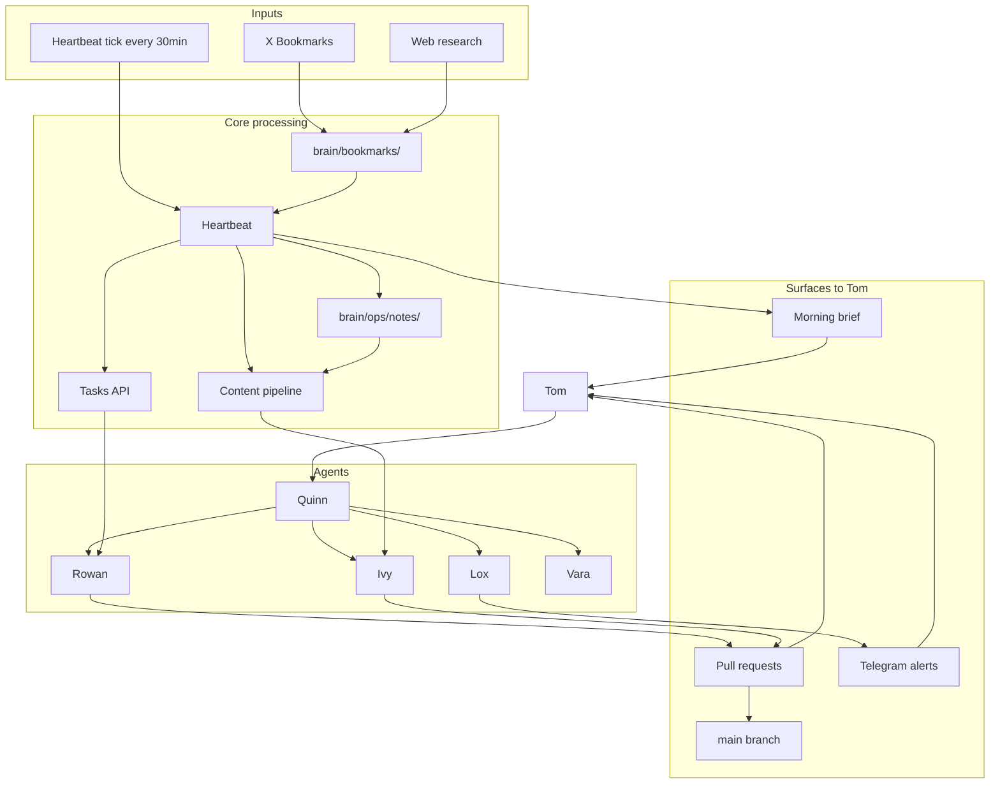
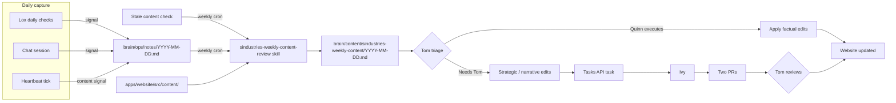
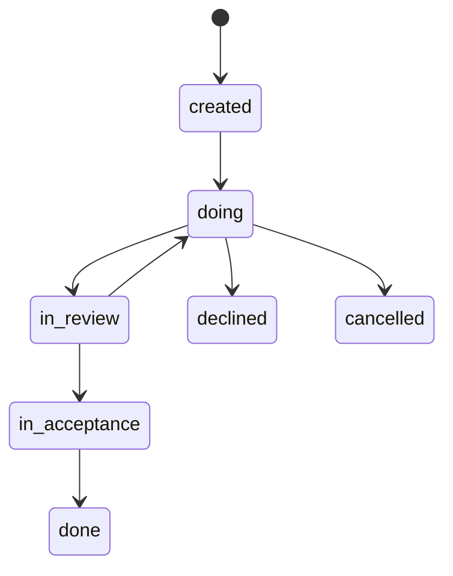
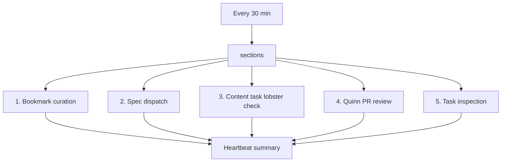
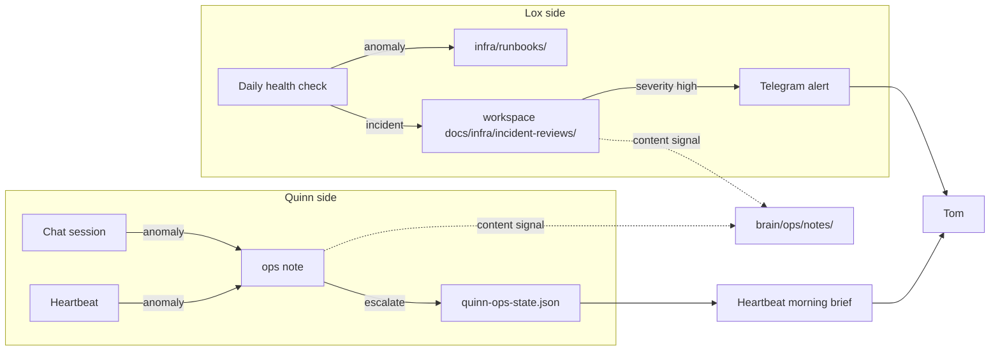

# Agent Orchestration

> The high-level map of how work flows through our setup. If something looks weird, start here, then drill into the linked system doc.

**Last reviewed:** 2026-08-14
**Owner:** Quinn (chief of staff)
**Audience:** Tom — when you need to remember what runs where

---

## Master View



**Four read paths for Tom:**
1. You ask Quinn → Quinn orchestrates → Rowan / Ivy / Lox → PR → you merge
2. Heartbeat ticks → finds actionable work → advances state → reports in morning brief
3. X bookmark or web link → ingest → curate → spec → task → Rowan → PR
4. Recall question → Quinn delegates to Vara → grounded answer with exact wiki citations

The morning brief also includes a dedicated **Tom's attention** section for every
active task where Tom appears in the ordered `attentionOwners` stack. Position 0
is labelled as action needed now; later positions are shown as escalation context.
This keeps the brief aligned with the same attention-owner routing surface used by
the heartbeat and Lobsters, rather than relying on assignee or legacy workflow-gate
fields.

---

## 1. Bookmark Workflow

Inbound links (X bookmarks, web research) become actionable tasks.

```mermaid
flowchart LR
  src[X / web source] --> ing[x-bookmark-ingest]
  ing --> bm[brain/bookmarks/]
  bm -->|lobster summarize| summarized
  summarized -->|heartbeat curate| curated
  curated -->|score above threshold| spec_req[spec_requested]
  curated -->|score below threshold| summarized
  spec_req -->|heartbeat writes spec| spec_created[spec_created]
  spec_created --> approval[approval_pending]
  approval -->|Tom approves| tasked
  tasked -->|Rowan implements| pr_opened[PR opened]
  pr_opened -->|merged| done
```



Bookmark workflow details live in `docs/systems/bookmark-workflow.md`. This document only needs the orchestration-level shape: bookmarks enter through ingest, Quinn curates and writes specs during heartbeat, Lobster owns approval delivery and task creation, and Rowan implements approved tasks.

**High-level guardrails**
- State transitions must go through the bookmark workflow state machine.
- Once a bookmark is tasked, secondary curations do not generate new specs by design.
- Tom sees approval messages for ready specs, not raw curation noise.

---

## 2. Content Pipeline

Public content flows from two streams that converge on the website:

1. **Ad hoc signals** (event-driven) — Lox incidents + Quinn ops notes + heartbeat observations land in daily notes
2. **Weekly review** (cron-driven) — Quinn compares last 7 days of notes against live website content, proposes edits
3. **Tom triage** — Quinn can execute items ship directly; Tom approval items move to a task
4. **Task → Ivy** — content-tasks dispatcher spawns Ivy, who drafts two PRs



**Cadence**

| Step | Cadence | Trigger |
|---|---|---|
| Daily ops notes | Continuous | Reflexive — write when something happens (per `memory/feedback_ops_notes_bar.md`) |
| Stale content check | Weekly | Weekly content review runs `sindustries-stale-content` |
| Weekly review | Weekly | Cron `sindustries-weekly-content` triggers `sindustries-weekly-content-review` skill |
| Tom triage | Weekly | Quinn notifies when review file ready |
| Content task dispatch | Every heartbeat tick | Heartbeat runs `content-tasks/run.py`; script discovers all active content tasks and runs the lobster pipeline once per task |

**How the content-tasks dispatcher works (heartbeat-driven, every tick):**

1. Heartbeat invokes `content-tasks/run.py` once per tick.
2. Script's `discover_tasks()` queries Tasks API for tasks in states `[open, ready, doing, acceptance]` where `taskType == "content"`. Dedupes by id.
3. For each found task, `run_workflow(task_id, capacity_limit)` spawns one `lobster run --mode tool` against `content-tasks/content-task.lobster.yaml` with `{taskId, ivyCapacityLimit}` as args.
4. The lobster pipeline is what actually orchestrates Ivy and owns all status transitions. Quinn just dispatches and reports failures / blocked PRs / meaningful transitions.

So: **1 heartbeat tick = 1 invocation of `content-tasks/run.py` = N lobster runs (one per active content task).** The script's CLI docstring says it explicitly: "Run one content-task workflow pass for every active content task."

**Why two streams:** Tom's bar for public content is high. Ops notes are cheap to capture; the weekly review applies judgment; Tom only sees a short triage list, not the raw notes.

**Key files**
- Notes: `brain/ops/notes/YYYY-MM-DD.md`
- Reviews: `brain/content/sindustries-weekly-content/YYYY-MM-DD.md`
- Content source: `codebases/sindustries/apps/website/src/content/`
- Skills: `agents/skills/content-notes/`, `agents/skills/content/sindustries-weekly-content-review/`, `agents/skills/content/sindustries-stale-content/`
- Dispatcher: `agents/workflows/content-tasks/run.py`
- Cron: `agents/crons/prompts/sindustries-weekly-content.md`

**Rules baked in from MEMORY.md**
- Ivy must not include internal technical refs (PR numbers, code module names, internal tool names like "Tasks API") in public content
- Quinn dispatches; Lobster owns status transitions
- Each weekly review **must** include both "Quinn can execute" and "Needs Tom approval" sections — never mirror a prior week whose Tom section was empty

---

## 3. Task Lifecycle

Cross-cutting workflow for everything in the Tasks API.



**Who can do what**
- **Agents (Rowan, Ivy):** open PRs, write code/copy, comment progress. **Cannot** change task state.
- **Quinn:** advances state via the Tasks API during heartbeat, after workflow-specific validation passes.
- **Tom:** reviews PRs, merges, approves in-acceptance items.

**Key files**
- API client: `agents/skills/ops/tasks-api/tasks_api_client.py`
- Prodlike API: `http://localhost:4001/api/v1`

---

## 4. Heartbeat

Runs every 30 min. Inspects state, advances what is actionable, reports.



**Sections in detail**

| # | Section | What it does | State it touches |
|---|---|---|---|
| 1 | Bookmark curation | Scores curated bookmarks against topics, refreshes stale curations | `bookmark-review-state.json` |
| 2 | Spec dispatch | Writes spec markdown for `spec_requested` items, max 2 per heartbeat | `bookmark-review-state.json` |
| 3 | Content task lobster | Reports only failures / blocked / meaningful transitions | none (read-only) |
| 4 | PR review | Lists open PRs assigned to Quinn, reviews for blockers | none (read-only) |
| 5 | Task inspection | Inspects heartbeat task set, advances valid tasks | Tasks API |

**Heartbeat never:**
- Modifies code
- Sends Tom approval requests for specs (that is the lobster's job)
- Skips the validate step (idempotent, safe to re-run)

**Key files**
- Config: `HEARTBEAT.md`
- Heartbeat state: `memory/heartbeat-state.json`
- Task list view: `tasks_api_client.py list --heartbeat`

---

## 5. Incidents and Ops Notes

How things go wrong, get noticed, and reach Tom.

**Two surfaces, one shared language:**

- **Lox (infra)** — runs health checks, catches infra incidents, writes runbooks and incident reviews, escalates via Telegram
- **Quinn (ops)** — notices workflow / process / agent anomalies during chat or heartbeat, writes ops notes, escalates via ops state and morning brief

Both can produce **content signals** that flow into the Content Pipeline.



**Lox → Tom**
- Cron failures → `notify-soft-fail` skill → sessions_send to Lox → Lox investigates → `openclaw message send --channel telegram --account lox` to Tom
- Hard failures: cron `failureAlert` (infrastructure level safety net)
- Soft failures: agent-level via `notify-soft-fail`
- Crons **never** message Tom directly — they go through Lox

**Quinn → Tom**
- Ops notes written reflexively in chat or heartbeat (per `memory/feedback_ops_notes_bar.md`)
- Escalations tracked in `quinn-ops-state.json` with severity, attempts, status
- Surface paths: heartbeat morning brief (most), direct Telegram (rare, only when urgent)
- Bar is LOW for notes; bar is HIGH for escalation

**Shared language:** Anything either side produces that could be public content becomes a row in `brain/ops/notes/YYYY-MM-DD.md` and feeds the Content Pipeline (see section 2).

**Key files**
- Lox logs: workspace `docs/infra/lox-daily-YYYY-MM-DD.md`
- Lox runbooks: `infra/runbooks/`
- Lox incident reviews: workspace `docs/infra/incident-reviews/`
- Lox notify: `agents/skills/ops/notify-soft-fail/`
- Quinn ops state: `quinn-ops-state.json` (in workspace root)
- Quinn ops notes: `memory/YYYY-MM-DD.md` (narrative) + `brain/ops/notes/YYYY-MM-DD.md` (content signals)

---

## Doc Tree — Where Things Live

| Location | Purpose | Owner |
|---|---|---|
| `brain/bookmarks/` | Inbound material (X, links, research) | x-bookmark-ingest |
| `brain/reviews/` | Our opinions / analysis on bookmarks | Quinn |
| `brain/tasks/specs/` | Implementation-target docs for feature tasks | Quinn / Rowan |
| `brain/wiki/` | Grounded recall catalog + append-only recall/lint history | Vara |
| `brain/posts/` | Public content (blog, social) | Ivy |
| `brain/ops/notes/` | Daily content signals (feeds weekly review) | Quinn / Lox |
| `brain/content/sindustries-weekly-content/` | Weekly review files for Tom triage | Quinn |
| workspace `docs/infra/` | Runbooks and setup docs | Quinn / Lox |
| `docs/systems/` (in sindustries repo) | Current system references and operational workflow docs | Quinn |
| `docs/specs/` (in sindustries repo) | Build-against specs and older planning artifacts | Quinn |

**Rule of thumb (from AGENTS.md):**
- raw / inbound idea → `brain/bookmarks/`
- interpretation / opinion → `brain/reviews/`
- build-against plan → `brain/tasks/specs/`
- publishable content → `brain/posts/`
- daily content signal → `brain/ops/notes/`
- weekly review for triage → `brain/content/sindustries-weekly-content/`
- system / workflow reference → `docs/systems/`
- current system / runbook → workspace `docs/infra/`

---

## Agent Roster

| Agent | Role | Writes | State it owns |
|---|---|---|---|
| **Quinn** | Orchestrator + front door | `MEMORY.md`, `AGENTS.md`, daily logs, workflow docs, ops notes | All task state transitions |
| **Rowan** | Developer | Code, PRs | Nothing (reads state, writes code) |
| **Ivy** | Content | Blog posts, public copy, website content edits | Nothing (read-only) |
| **Lox** | Infra + incidents | Runbooks, daily health logs, incident reviews | Incident state, ops alerts |
| **Vara** | Grounded recall | `brain/wiki/index.md`, `brain/wiki/log.md` through the helper | Wiki catalog + lint/query history |

**Critical rule:** Agents (Rowan, Ivy, Lox) **never** change task status, blocked, or completedAt. Only Quinn during heartbeat.

---

## When Something Looks Weird

Quick troubleshooting pointer — find the symptom and check the file.

| Symptom | First place to look |
|---|---|
| Bookmark stuck in a state | `brain/state/bookmark-review-state.json` |
| Spec never written | `brain/state/spec-output.json` last entry + validate step output |
| Task not advancing | `HEARTBEAT.md` + task comments for failed criteria |
| Heartbeat silently broken | `HEARTBEAT.md` + `cron list` |
| PR not appearing | `gh pr list --repo Stoffer-Industries/sindustries` |
| Curation scores stale | `brain/state/bookmark-review-state.json` → check `curation.createdAt` |
| Weekly content review missing | `agents/crons/prompts/sindustries-weekly-content.md` + last entry in `brain/content/sindustries-weekly-content/` |
| Wiki citation looks wrong or missing | `brain/wiki/index.md` + `brain/wiki/log.md` + `agents/workflows/wiki/wiki_catalog.py lint --json` |
| Infra incident | workspace `docs/infra/incident-reviews/` + Lox daily log |
| Lox did not escalate | `agents/skills/ops/notify-soft-fail/SKILL.md` delivery chain |
| Quinn escalation stuck | `quinn-ops-state.json` → check `attempts` and `severity` |

---

## 6. Grounded Recall

Vara owns the markdown-first recall layer over selected workspace knowledge.

- `brain/wiki/index.md` is the sole catalog and citation allowlist.
- `brain/wiki/log.md` is the sole append-only history for ingest, query, and lint events.
- Summary completion, spec validation, and bookmark-spec → task-spec moves update the wiki incrementally through `agents/workflows/wiki/wiki_catalog.py`.
- Recall answers must cite exact indexed paths and must not broaden into uncatalogued `brain/` content or deep external research.
- Daily dead-link lint is isolated in `agents/crons/prompts/vara-deadlink-lint.md`; broken references alert Lox/Quinn but are never auto-deleted.

This keeps personal knowledge recall inside the workspace/OpenClaw boundary rather than introducing a product service or hidden index.

---

## 7. OpenClaw Runtime

OpenClaw is the gateway process that runs all agents. It handles channel routing, session lifecycle, cron scheduling, tool execution, and model calls.

```
Tom's machine
  openclaw gateway (node process)
    ├── Channel adapters (Telegram, Signal)
    ├── Session manager (per-agent conversation contexts)
    ├── Cron scheduler (fires agent sessions on schedule)
    ├── Tool executor (exec, web_fetch, sessions_send, etc.)
    └── Model router (Anthropic / OpenAI)

~/.openclaw/
  openclaw.json      gateway config
  workspace/         Quinn's home (sindustries repo lives here)
  .env               secrets (API keys, tokens)
```

**Session keys:**

| Agent | Session key | Primary channel |
|---|---|---|
| Quinn | `agent:quinn` | Telegram DMs / Sindustries group |
| Rowan | `agent:rowan` | Sindustries infra topic |
| Ivy | `agent:ivy` | Internal only |
| Lox | `agent:lox` | Sindustries infra topic |
| Vara | `agent:vara` | Internal only |

**Channel routing:** Messages arrive via Telegram and are routed to the correct agent based on chat ID and topic ID. Authorized senders are configured in `openclaw.json` under `channels.telegram.allowFrom`. Only Tom's number is allowlisted.

**Brain:** `~/.openclaw/workspace/brain/` is a symlink into iCloud Drive. It holds private data (product specs, state files, ops notes) that must not live in git. Git worktrees for sindustries branches must not materialise a real `brain/` directory — the path must always remain a symlink.

**`.openclaw/` write boundary:** Only Quinn can write to `~/.openclaw/`. When Rowan or another agent needs a gateway config change, they post `[openclaw-needed]` on the task; Quinn applies it during heartbeat and posts `[openclaw-done]`.

**Config:** `openclaw.json` — edit via `openclaw config set <field> <value>` or direct JSON edit. Restart after changes: `openclaw gateway restart`. Key fields: `agents.defaults.workspace`, `agents.defaults.heartbeat.every`, `channels.telegram.allowFrom`, `crons`.

**Cron jobs:** Defined in `agents/crons/prompts/` as `.md` files. Registered in `openclaw.json`. Run `cron list` to verify. `openclaw gateway status` / `openclaw gateway restart` for health.

---

## See Also

- `docs/systems/bookmark-workflow.md` — bookmark workflow state machine and script map
- `docs/systems/tasks.md` — Tasks API data model, comment tag protocol, dependency system, all three workflows
- `AGENTS.md` — workspace conventions
- `MEMORY.md` — long-term memory (includes guardrails and lessons learned)
- `agents/rowan/SOUL.md` — Rowan's operating contract
- `agents/skills/` — individual skill docs (bookmarks/curate, product/spec-author, ops/tasks-api, content-notes, sindustries-weekly-content-review, ops/notify-soft-fail)
