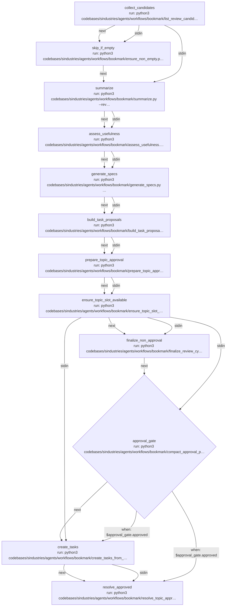

```mermaid
flowchart TD
  collect_candidates["collect_candidates\nrun: python3 codebases/sindustries/agents/workflows/bookmark/list_review_candid…"]
  skip_if_empty["skip_if_empty\nrun: python3 codebases/sindustries/agents/workflows/bookmark/ensure_non_empty.p…"]
  summarize["summarize\nrun: python3 codebases/sindustries/agents/workflows/bookmark/summarize.py --rev…"]
  assess_usefulness["assess_usefulness\nrun: python3 codebases/sindustries/agents/workflows/bookmark/assess_usefulness.…"]
  generate_specs["generate_specs\nrun: python3 codebases/sindustries/agents/workflows/bookmark/generate_specs.py …"]
  build_task_proposals["build_task_proposals\nrun: python3 codebases/sindustries/agents/workflows/bookmark/build_task_proposa…"]
  prepare_topic_approval["prepare_topic_approval\nrun: python3 codebases/sindustries/agents/workflows/bookmark/prepare_topic_appr…"]
  ensure_topic_slot_available["ensure_topic_slot_available\nrun: python3 codebases/sindustries/agents/workflows/bookmark/ensure_topic_slot_…"]
  finalize_non_approval["finalize_non_approval\nrun: python3 codebases/sindustries/agents/workflows/bookmark/finalize_review_cy…"]
  approval_gate{"approval_gate\nrun: python3 codebases/sindustries/agents/workflows/bookmark/compact_approval_p…"}
  create_tasks["create_tasks\nrun: python3 codebases/sindustries/agents/workflows/bookmark/create_tasks_from_…"]
  resolve_approved["resolve_approved\nrun: python3 codebases/sindustries/agents/workflows/bookmark/resolve_topic_appr…"]

  collect_candidates -->|next| skip_if_empty
  collect_candidates -->|stdin| skip_if_empty
  skip_if_empty -->|next| summarize
  collect_candidates -->|stdin| summarize
  summarize -->|next| assess_usefulness
  summarize -->|stdin| assess_usefulness
  assess_usefulness -->|next| generate_specs
  assess_usefulness -->|stdin| generate_specs
  generate_specs -->|next| build_task_proposals
  generate_specs -->|stdin| build_task_proposals
  build_task_proposals -->|next| prepare_topic_approval
  build_task_proposals -->|stdin| prepare_topic_approval
  prepare_topic_approval -->|next| ensure_topic_slot_available
  prepare_topic_approval -->|stdin| ensure_topic_slot_available
  ensure_topic_slot_available -->|next| finalize_non_approval
  ensure_topic_slot_available -->|stdin| finalize_non_approval
  finalize_non_approval -->|next| approval_gate
  ensure_topic_slot_available -->|stdin| approval_gate
  approval_gate -->|next| create_tasks
  ensure_topic_slot_available -->|stdin| create_tasks
  approval_gate -->|when: $approval_gate.approved| create_tasks
  create_tasks -->|next| resolve_approved
  create_tasks -->|stdin| resolve_approved
  approval_gate -->|when: $approval_gate.approved| resolve_approved
```
