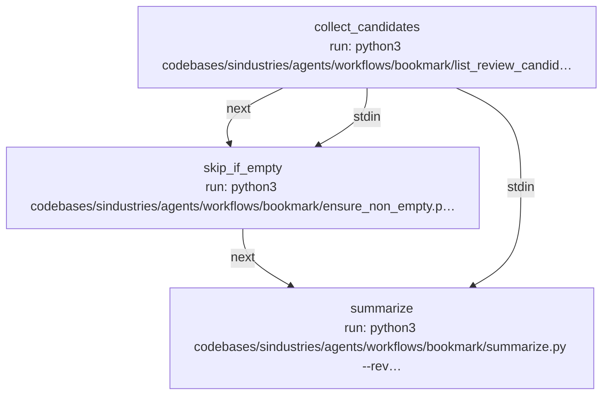

```mermaid
flowchart TD
  collect_candidates["collect_candidates\nrun: python3 codebases/sindustries/agents/workflows/bookmark/list_review_candid…"]
  skip_if_empty["skip_if_empty\nrun: python3 codebases/sindustries/agents/workflows/bookmark/ensure_non_empty.p…"]
  summarize["summarize\nrun: python3 codebases/sindustries/agents/workflows/bookmark/summarize.py --rev…"]

  collect_candidates -->|next| skip_if_empty
  collect_candidates -->|stdin| skip_if_empty
  skip_if_empty -->|next| summarize
  collect_candidates -->|stdin| summarize
```
